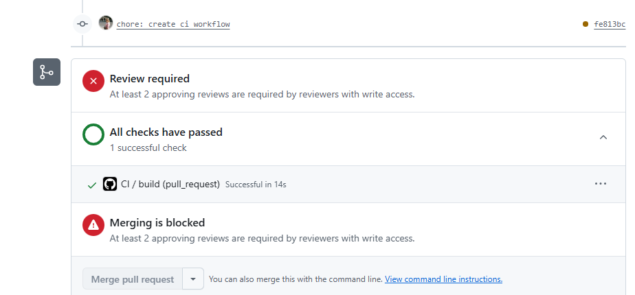

## 26.02.2026

Work on creating CI - Continuous integration.

  - created
  ```.github/
     └─ workflows/
         └─ ci.yml
  ```
  - file ci.yml sets when to run checkin process (while pushing to main branch and PR)
  - GitHub runs your CI and provides the results of each test in the pull request, so we can see whether the change in our branch introduces an error
  - the process was sucessfully tested




## To do:
prepare brief explanation to introduce Continuous integration (CI) for team members