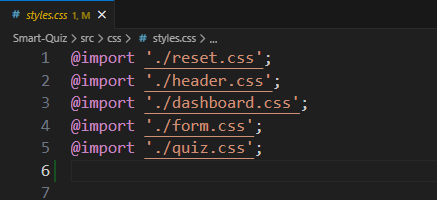

# CSS flow:

- main.ts импортирует styles.css

- styles.css использует @import './login.css'

- Vite объединяет все

Пример:





### Это означает, что:
- Vite рассматривает CSS как зависимость
- Он объединяет все импортированные файлы CSS вместе
- Стили являются глобальными

### Aрхитектура:

```main.ts
  ↓
main.css
  ↓
вход в систему.css
```
**Все стили попадают в одну глобальную таблицу стилей.**

Мы объединяем CSS в несколько файлов (например, login.css) и импортируем их через основную таблицу стилей (main.css). Vite разрешает этот импорт и объединяет его в окончательную сборку. Стили остаются глобальными, но структура сохраняет организованность проекта.


2. Получаем:
- упорядоченный CSS
- пакетирование файлов
- горячую перезагрузку
- оптимизацию производства

**Наше приложение использует глобальный CSS, организованный в файлы функций. Vite автоматически обрабатывает импорт CSS и компонует его, поэтому нам не понадобились дополнительные загрузчики или инструменты CSS-модуля.**
